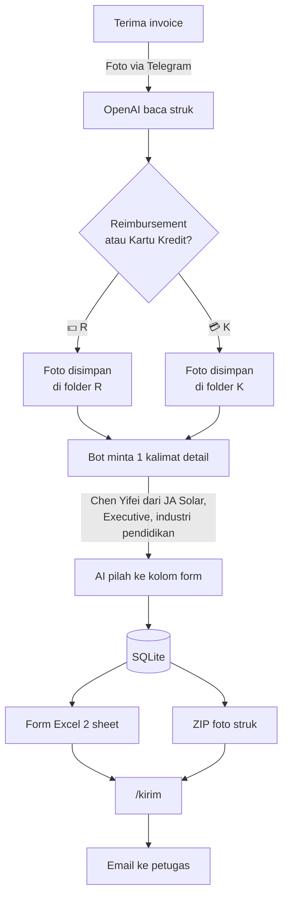

# 🧾 Sistem Otomasi Reimbursement

Foto struk lewat Telegram → dibaca otomatis oleh OpenAI → masuk form Excel
**Daftar Nominatif** (2 sheet: Reimbursement & Kartu Kredit) → dikirim via email
ke petugas pengumpul saat kamu memberi perintah.

- **Author:** Juan Davis
- **Status:** Implementasi awal, siap dipakai internal

---

## Tiga Tahap



**Tahap 1 — Capture.** Foto struk → dibaca: tanggal, merchant, alamat, kategori, jumlah.
Kamu pilih Reimbursement atau Kartu Kredit; foto langsung dipindah ke folder **R** atau **K**.

**Tahap 2 — Lengkapi.** Bot minta satu kalimat bebas, contoh:

> *Chen Yifei dan Huang Xinmin dari JA Solar, Executive, industri pendidikan, yang ikut Ariadi, Alex Janu, Galih*

AI memilahnya ke kolom Nama / Posisi / Perusahaan / Industri / Karyawan Internal.
Untuk struk non-jamuan (taksi, bensin, ATK) ketik `-` saja — kolom tamu dikosongkan.

**Tahap 3 — Kirim.** `/kirim` → konfirmasi → form Excel + ZIP foto dikirim ke email
yang terdaftar di `EMAIL_TO`.

---

## Bentuk Form Excel

Meniru template Daftar Nominatif perusahaan, dua sheet dengan struktur identik:

```
                          FORM REIMBURSEMENT
                          Periode Agustus 2026

NPK        : 1908005
JABATAN    : Directur                    setelah karyawan selesai melakukan
DEPARTEMEN : BOD                         perjalanan dinas dengan melampirkan
PERUSAHAAN : PT. Triputra Energi ...     semua bukti transaksi asli

┌────┬──────────┬──────────────────────────────┬──────────────────────┬────────┬────────┬──────────┐
│ NO │ Tanggal  │      Orang yang dijamu       │ Menjamu klien/mitra  │ Tujuan │ Jumlah │ Karyawan │
│    │          ├───────┬───────┬────────┬─────┼───────┬───────┬──────┤        │        │ Internal │
│    │          │ Nama  │Posisi │Perush. │Indus│Lokasi │Alamat │ Tipe │        │        │          │
└────┴──────────┴───────┴───────┴────────┴─────┴───────┴───────┴──────┴────────┴────────┴──────────┘

                                              SUB TOTAL              9,205,000
                                              GRAND TOTAL        Rp  9,205,000
                                              PEMBAYARAN DIMUKA  Rp          0
                                              SALDO AKHIR        Rp  9,205,000

  Diajukan oleh,        Disetujui oleh,          Diketahui oleh,
  Karyawan              Atasan                   HRGA Senior Manager
```

**Merchant dari struk masuk ke kolom `Lokasi`** — di form aslimu kolom itu memang berisi
nama restoran (Remboelan, Pagi Sore, Ko.Kuu).

Foto **tidak** disisipkan ke dalam form, supaya layout dokumen resmi tidak berubah.
Foto dikirim terpisah dalam ZIP, dinamai sesuai nomor barisnya —
`Reimbursement/003_2026-08-18_Lapis - Lapis.jpg` = baris 3 di sheet Reimbursement.

---

## Struktur File

| File | Fungsi |
|---|---|
| [bot.py](bot.py) | Bot Telegram — alur 3 tahap, command, tombol inline |
| [extractor.py](extractor.py) | OpenAI vision (baca struk) + pemilah kalimat bebas |
| [excel_report.py](excel_report.py) | Bangun form Excel 2 sheet + ZIP foto |
| [receipt_image.py](receipt_image.py) | Potong struk dari latar + susun lembar lampiran PDF |
| [dashboard.py](dashboard.py) | Dashboard HTML mandiri untuk tracking per bulan & per karyawan |
| [db.py](db.py) | Skema & query SQLite |
| [mailer.py](mailer.py) | Kirim form via SMTP dengan lampiran |
| [config.py](config.py) | Semua setting, dibaca dari `.env` |

Data tersimpan di `data/` (otomatis dibuat, sudah di-`.gitignore`):

```
data/
├── reimbursement.db
├── photos/
│   ├── inbox/          # sementara, sebelum user pilih R atau K
│   ├── R/2026-08/      # Reimbursement
│   └── K/2026-08/      # Kartu Kredit
└── exports/            # Reimbursement Juan Davis Aug 2026.xlsx, Struk_2026-08.zip
```

**SQLite adalah sumber kebenaran, bukan Excel.** File Excel di-generate ulang setiap
ada entri baru atau dihapus, jadi rekap selalu akurat dan bisa dibuat ulang kapan saja.

---

## Setup

### 1. Install dependency

```powershell
cd "C:\Users\juan.davis\Downloads\Reimbursement"
python -m venv .venv
.venv\Scripts\activate
pip install -r requirements.txt
```

### 2. Buat bot Telegram

Chat **@BotFather** → `/newbot` → salin token.

### 3. Isi konfigurasi

```powershell
copy .env.example .env
notepad .env
```

Wajib: `TELEGRAM_BOT_TOKEN`, `OPENAI_API_KEY`, `ALLOWED_TELEGRAM_USER_IDS`.
Isi juga identitas karyawan (`KARYAWAN_NPK`, `KARYAWAN_JABATAN`, dst) — itu yang
mengisi kepala form Excel.

> **Belum tahu Telegram user ID kamu?** Isi `ALLOWED_TELEGRAM_USER_IDS=0` dulu,
> jalankan bot, kirim `/start` — bot membalas dengan ID kamu. Masukkan ke `.env`, restart.

### 4. Jalankan

```powershell
python bot.py
```

Bot memakai **long polling** — tidak butuh server publik atau domain. Cukup jalan di
laptop atau PC kantor yang menyala.

---

## Perintah

| Perintah | Fungsi |
|---|---|
| *(kirim foto)* | Catat struk baru |
| `/rekap` | Ringkasan bulan ini |
| `/rekap 2026-07` | Ringkasan bulan tertentu |
| `/excel` | Form Excel + lampiran PDF + ZIP foto asli |
| `/lembar` | Lembar lampiran struk saja (PDF, siap cetak) |
| `/dashboard` | Dashboard tracking (HTML, buka di browser) |
| `/kirim` | Email form ke `EMAIL_TO` (minta konfirmasi dulu) |
| `/list` | 10 entri terakhir beserta ID-nya |
| `/hapus 12` | Hapus entri `#12` |
| `/batal` | Batalkan struk yang sedang ditanyakan |

---

## Lembar Lampiran Struk

`/lembar` menghasilkan PDF A4 berisi semua struk satu periode: **dipotong dari
latar** (tangan, meja, lantai), diurutkan tanggal, diberi label `R-01`, `K-01`
yang cocok dengan nomor baris di form Excel. Tata letaknya adaptif — tiga struk
melebar satu baris, sembilan struk jadi grid 3×3, lebih dari itu pindah halaman.

Pemotongannya memakai fakta bahwa **kertas struk hampir tidak punya saturasi
warna**, sedangkan kulit tangan dan meja kayu selalu hangat. Deteksi lewat kanal
saturasi HSV jauh lebih andal daripada lewat kecerahan — lantai kayu yang terang
ikut terbaca sebagai "putih" kalau memakai ambang kecerahan.

Ini heuristik, bukan model AI. Akan meleset kalau struk difoto di atas **meja
putih**, atau kertasnya kusam kekuningan. Kalau gagal, kode jatuh ke foto asli
tanpa dipotong — tidak pernah memotong struknya sendiri. Parameternya
(`SAT_MAX`, `VAL_MIN`, `ROW_MAX_FRAC`) ada di atas [receipt_image.py](receipt_image.py).

> Hasil terbaik: foto di atas permukaan **gelap dan kontras**, tanpa tangan menutupi.

---

## Dashboard

`/dashboard` menghasilkan satu file HTML mandiri — tanpa server, tanpa internet,
tanpa pustaka eksternal. Isinya:

- **Hero** — total bulan berjalan + perubahan % dari bulan lalu
- **Stat tiles** — jumlah struk, total Reimbursement, total Kartu Kredit, struk belum lengkap
- **Grafik batang** — pengeluaran per bulan, ditumpuk per jenis pembayaran, dengan tooltip
- **Rekap per karyawan** — tiap karyawan × bulan, dipecah R/K
- **Tabel struk** bulan berjalan

Ikut mode gelap/terang browser. Warna dua deretnya sudah divalidasi aman untuk
buta warna di kedua mode.

---

## Catatan Keamanan

Sistem ini menyimpan data finansial asli, jadi:

- **`.env` dan `data/` tidak pernah masuk git** — sudah diatur di `.gitignore`.
- Bot memakai **allowlist**: hanya user ID di `ALLOWED_TELEGRAM_USER_IDS` yang dilayani.
  Default kosong, artinya menolak semua orang sampai sengaja diisi — bot Telegram itu
  publik, siapa pun yang tahu namanya bisa mengirim chat.
- Struk duplikat ditangkap dua lapis: **hash SHA-256** menolak file foto yang
  identik, dan kecocokan **merchant + tanggal + nominal** memberi peringatan saat
  struk yang sama difoto ulang (byte berbeda, hash lolos). Lapis kedua hanya
  memperingatkan, tidak menolak — dua struk identik yang sah memang mungkin.
- Hapus bersifat **soft delete** — data tetap ada di database untuk jejak audit.
- Untuk Gmail, gunakan **App Password**, bukan password akun utama.

---

## Pengembangan Berikutnya

| Ide | Kenapa berguna |
|---|---|
| Ingat profil tamu | Ketik "Chen Yifei" saja, posisi/perusahaan/industri terisi otomatis |
| Import Excel/CSV | Input massal untuk struk yang sudah terlanjur dicatat manual |
| Baca dari email | Invoice yang masuk lewat email ikut terproses otomatis |
| Edit lewat chat | `/edit 12 jumlah 500000` tanpa perlu buka Excel |
| Jadwal otomatis | Kirim form tiap tanggal 25 tanpa `/kirim` manual |
