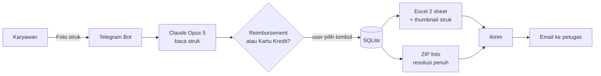

# 🧾 Sistem Otomasi Reimbursement

Foto struk lewat Telegram → dibaca otomatis oleh Claude → masuk rekap Excel 2 sheet
(**Reimbursement** & **Kartu Kredit**) lengkap dengan foto strukanya → dikirim via email
ke petugas pengumpul saat kamu memberi perintah.

- **Author:** Juan Davis
- **Status:** Implementasi awal, siap dipakai internal

---

## Alur Kerja



**SQLite adalah sumber kebenaran, bukan Excel.** File Excel di-generate ulang setiap kali
ada entri baru atau dihapus. Artinya file rekap selalu akurat, tidak pernah korup karena
ditulis bersamaan, dan bisa dibuat ulang kapan saja untuk periode mana pun.

---

## Struktur File

| File | Fungsi |
|---|---|
| [bot.py](bot.py) | Bot Telegram — handler foto, command, tombol inline |
| [extractor.py](extractor.py) | Baca struk dengan Claude vision → objek Pydantic tervalidasi |
| [excel_report.py](excel_report.py) | Bangun Excel 2 sheet + embed thumbnail + ZIP foto |
| [db.py](db.py) | Skema & query SQLite |
| [mailer.py](mailer.py) | Kirim rekap via SMTP dengan lampiran |
| [config.py](config.py) | Semua setting, dibaca dari `.env` |

Data tersimpan di `data/` (otomatis dibuat, sudah di-`.gitignore`):

```
data/
├── reimbursement.db          # database
├── photos/2026-09/*.jpg      # foto struk asli, per bulan
└── exports/                  # Rekap_Pengeluaran_2026-09.xlsx, Struk_2026-09.zip
```

---

## Setup

### 1. Install dependency

```powershell
cd "C:\Users\juan.davis\Downloads\Reimbursement"
python -m venv .venv
.venv\Scripts\activate
pip install -r requirements.txt
```

### 2. Buat bot Telegram

Chat **@BotFather** di Telegram → `/newbot` → ikuti instruksi → salin token yang diberikan.

Opsional, daftarkan menu perintah lewat `/setcommands`:

```
rekap - Ringkasan pengeluaran bulan ini
excel - Kirim file Excel ke chat
kirim - Email rekap ke petugas
list - 10 entri terakhir
hapus - Hapus satu entri
help - Bantuan
```

### 3. Isi konfigurasi

```powershell
copy .env.example .env
notepad .env
```

Isi minimal `TELEGRAM_BOT_TOKEN`, `ANTHROPIC_API_KEY`, dan `ALLOWED_TELEGRAM_USER_IDS`.

> **Belum tahu Telegram user ID kamu?** Isi `ALLOWED_TELEGRAM_USER_IDS=0` dulu, jalankan bot,
> kirim `/start` — bot akan membalas dengan ID kamu. Masukkan ID itu ke `.env`, lalu restart bot.

### 4. Jalankan

```powershell
python bot.py
```

Bot memakai **long polling**, jadi tidak butuh server publik atau domain. Cukup jalan di
laptop atau PC kantor yang menyala.

---

## Cara Pakai

1. **Foto struk** → kirim ke bot.
2. Bot balas hasil bacaan: merchant, tanggal, kategori, total, PPN.
3. Tekan tombol **💵 Reimbursement** atau **💳 Kartu Kredit**.
   Bot menebak dari struk (kalau ada jejak EDC/kartu, tombol Kartu Kredit ditaruh duluan),
   tapi keputusan akhir tetap di kamu — struk tidak selalu menunjukkan siapa yang membayar.
4. Entri masuk database, Excel langsung diperbarui.
5. Saat rekap siap: **`/kirim`** → konfirmasi → email terkirim dengan lampiran Excel + ZIP foto.

### Perintah

| Perintah | Fungsi |
|---|---|
| `/rekap` | Ringkasan bulan ini di chat |
| `/rekap 2026-08` | Ringkasan bulan tertentu |
| `/excel` | Kirim file Excel + ZIP ke chat ini |
| `/kirim` | Email rekap ke `EMAIL_TO` (minta konfirmasi dulu) |
| `/list` | 10 entri terakhir milikmu, beserta ID-nya |
| `/hapus 12` | Hapus entri `#12` |

---

## Isi File Excel

Dua sheet, masing-masing dengan kolom:

| No | Tanggal | Merchant | Deskripsi | Kategori | Subtotal | PPN | Total | Pemohon | Struk |
|---|---|---|---|---|---|---|---|---|---|

- Kolom **Struk** berisi thumbnail foto langsung di dalam sel — reviewer tidak perlu
  buka file lain untuk memverifikasi.
- Baris **TOTAL** otomatis di bawah.
- Header di-*freeze* dan ada filter, jadi mudah disortir.
- Foto resolusi penuh ikut terkirim dalam ZIP terpisah, dinamai
  `Reimbursement/001_2026-09-03_Grab_id12.jpg` agar mudah dicocokkan dengan barisnya.

---

## Catatan Keamanan

Sistem ini menyimpan data finansial asli, jadi:

- **`.env` dan `data/` tidak pernah masuk git** — sudah diatur di `.gitignore`.
- Bot memakai **allowlist**: hanya user ID di `ALLOWED_TELEGRAM_USER_IDS` yang dilayani.
  Default-nya kosong, artinya menolak semua orang sampai sengaja diisi.
- Struk duplikat ditolak otomatis lewat hash SHA-256 file foto.
- Hapus bersifat **soft delete** — data tetap ada di database untuk jejak audit,
  hanya tidak muncul di rekap.
- Untuk Gmail, gunakan **App Password**, bukan password akun utama.

---

## Kategori Pengeluaran

`Transportasi`, `Akomodasi`, `Makan & Entertain`, `Perlengkapan Kantor`,
`Komunikasi`, `Kesehatan`, `Pelatihan & Seminar`, `Lain-lain`

Ubah daftarnya di `CATEGORIES` pada [config.py](config.py) — prompt ke Claude ikut
menyesuaikan otomatis.

---

## Pengembangan Berikutnya

| Ide | Kenapa berguna |
|---|---|
| Import Excel/CSV & email | Sudah disebut sebagai input, belum diimplementasi |
| Approval atasan | Tombol approve/reject sebelum masuk rekap final |
| Deteksi limit kebijakan | Warning kalau nominal melebihi batas per kategori |
| Jadwal otomatis | Kirim rekap tiap tanggal 25 tanpa perlu `/kirim` manual |
| Export format accounting | Sesuaikan kolom dengan template SAP/Accurate |
